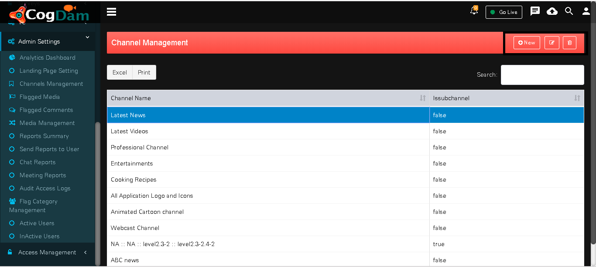

# Create or Edit  Channel

 User can fill the relevant fields like name and select appropriate options like featured icon/channel/sub-channel/exclude from library, etc. ****For editing a channel, the user can click on orange icon ‘Edit’ and modify the contents of the channel. Similarly, the user can delete a channel by clicking on red icon ‘Delete’.

