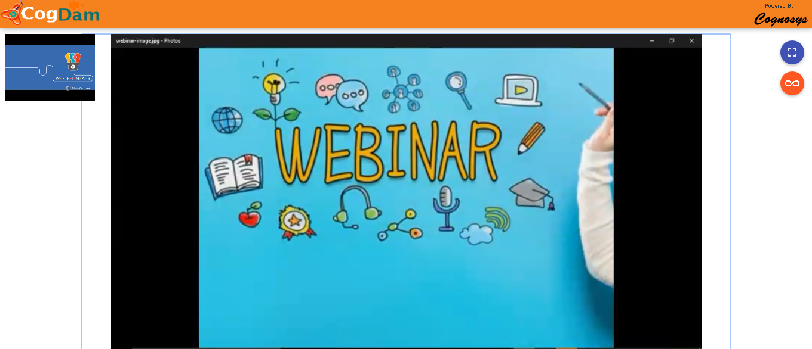

# Live Stream

You Can Create A New Event By Clicking On Create New Event Tab

Fill The Relevant Information And Click Next

Click On Create Meeting Tab

Create Meeting And Save

Choose The Channel And Next  

Assign Group And Save

When clicks on Golive then Event get started and join now pop up comes on display of user

Click on share icon to share  link

Goilve Single user link feed

Goilve Single user screenshare feed

Golive Public link view feed

Goilve Public link screenshare feed

