# HR

HR functionality helps in scheduling Interview , helps streamline, automates, and sync the entire interview scheduling process for all parties involved.

To schedule any Hr meeting , user can go to HR-&gt;Schedule interview

User can enter the interview candidate details and add the candidate in the meeting.

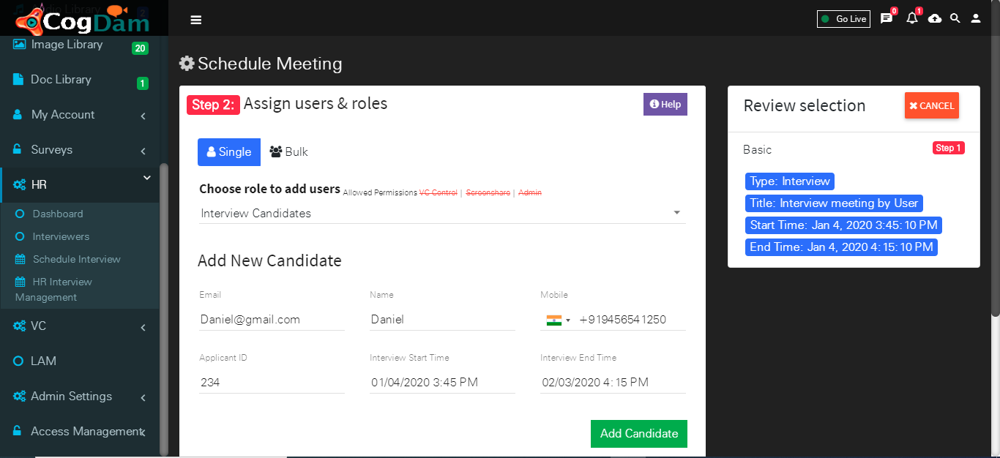

After adding the candidate the candidate will receive a mail and by clicking on the link candidate will be added to the meeting

For the same meeting interviewers can be added in the meeting by selecting the interviewer option from drop down list .

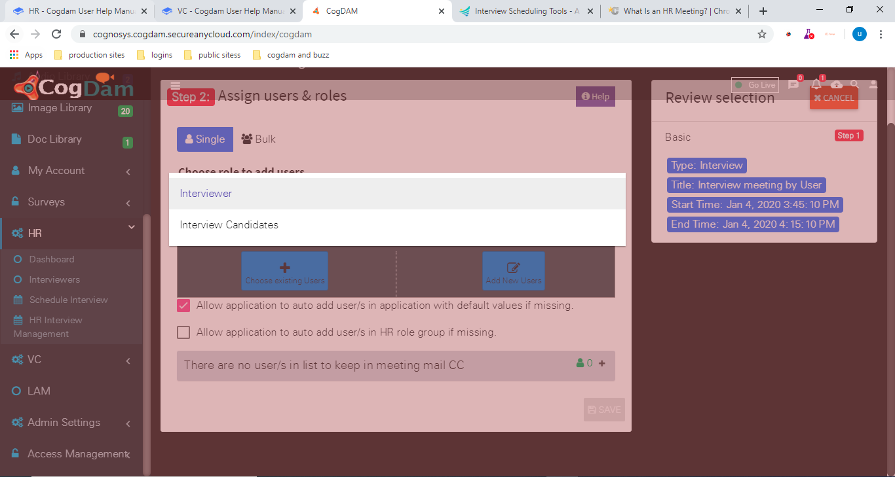

Interviewers can be added in the meeting that are registered or not registered in the application . For the registered interviewers user can select the user from the existing users list . For adding non registered users , add new users option can be opt by the user.

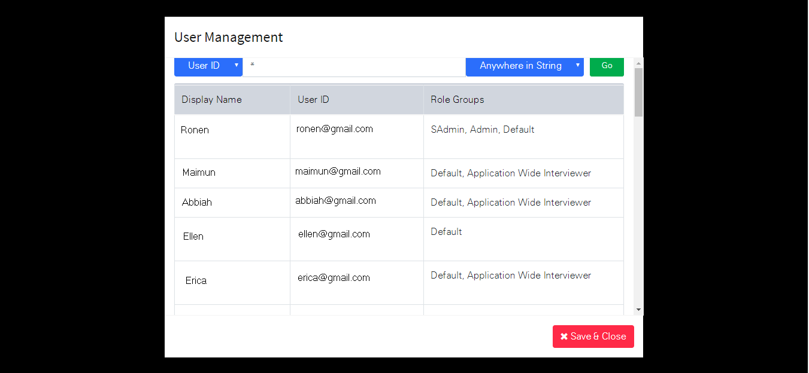

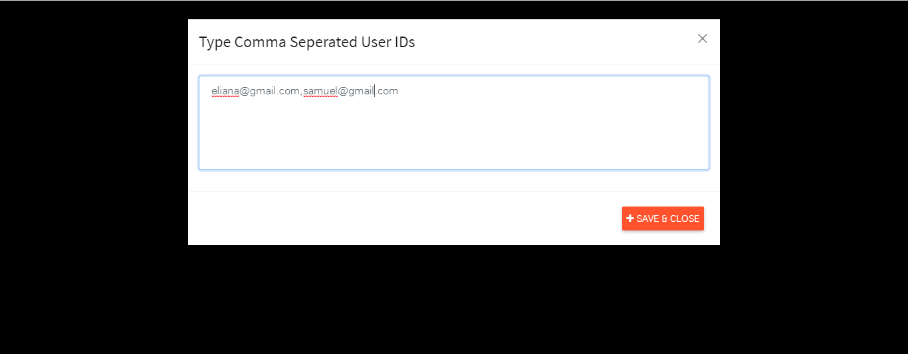

Clicking on Save button will schedule the interview and it navigates to the Hr interview management page where users can see all the scheduled interview detailed list.

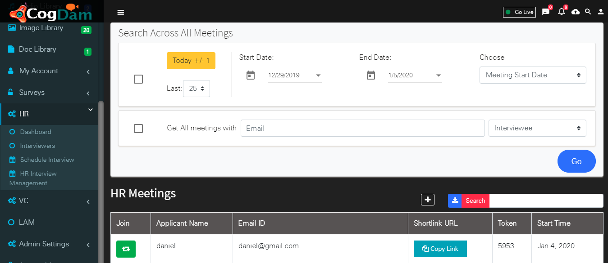

Scheduled Hr meeting can be edited , deleted and previewed through hr interview management page. User needs to select the particular meeting from the list and then edit, delete preview icons get enabled through which desired particular action can be performed.

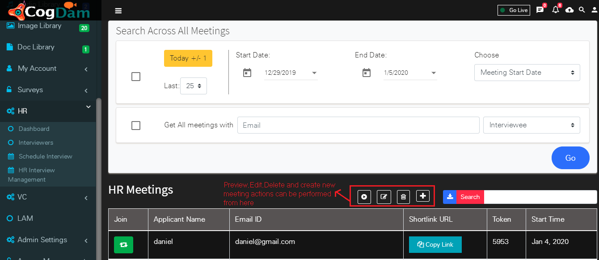

Scheduled Hr meeting , interview candidate and and interviewer will receive the mails at their respective Email ids . In that mails they will receive the links to join the meeting.Candidate will receive the token along with that link. After hitting that link it will navigate to login screen.

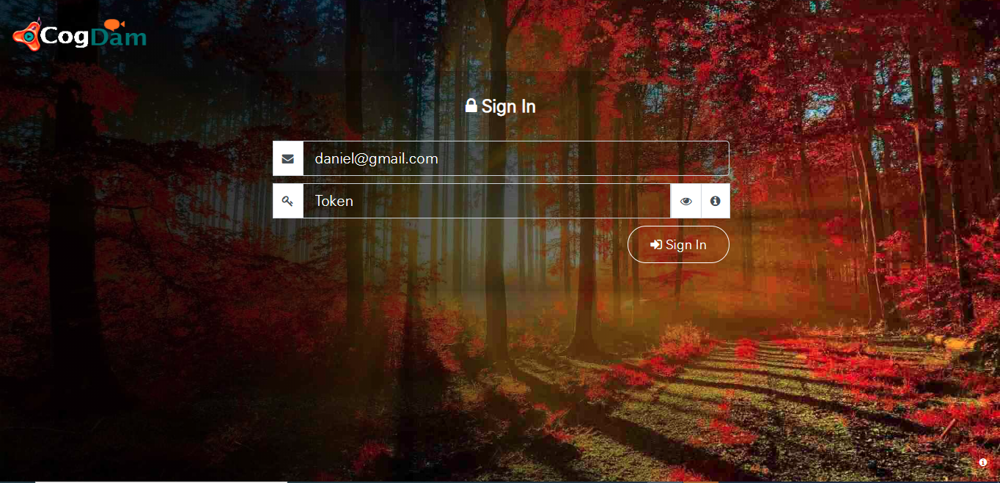

After login into the application interviewer and candidate navigates to join window .After clicking on join user join into the meeting. Users vc feed will show on the screen and both can share their screen .

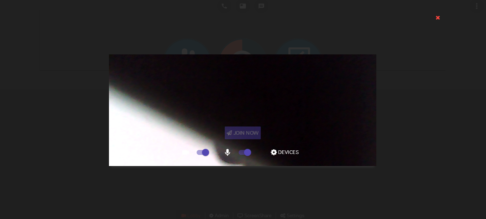

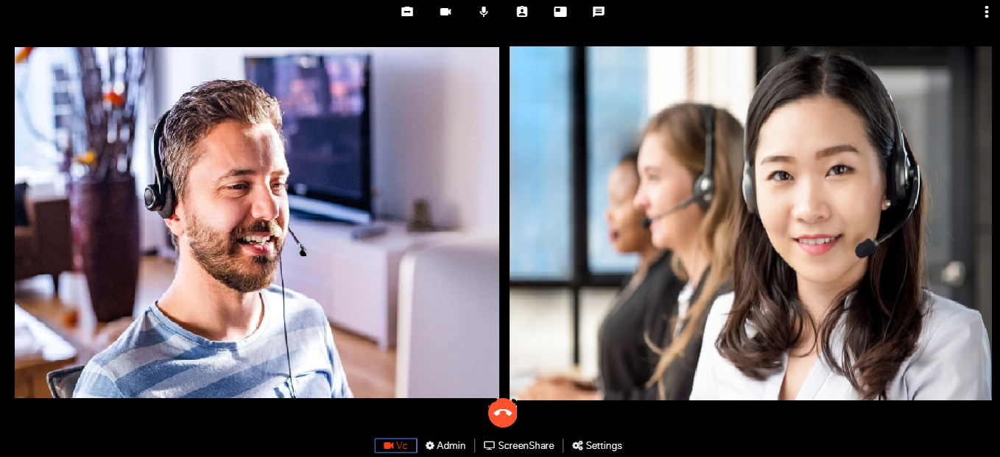

Interviewer has the authority to control candidate vc controls.By clicking on Vc control Red icon candidate will be pulled in or pushed out from the meeting by the interviewers.

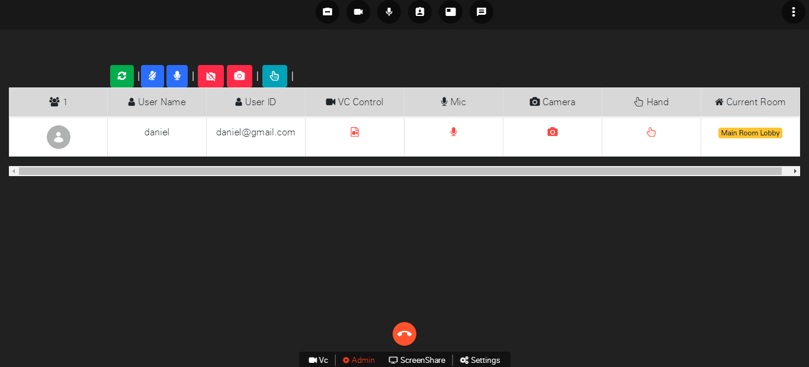

Candidate and interviewer can chat in the meeting and also can send the chat attachment like audio, video , files , images to each other.

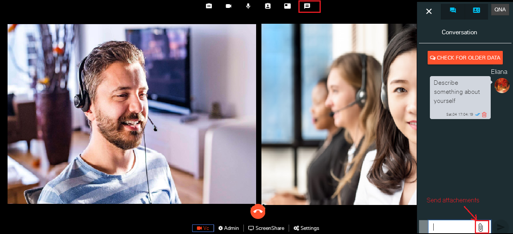

After meeting is done , meeting can be disconnected from the disconnect button. After clicking the disconnect button two pop up will appear . Click on yes then meeting get disconnects.

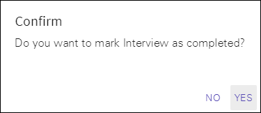

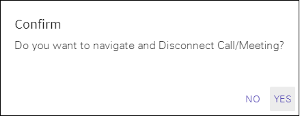

Registered user having the permission of Hr meeting creators can have the shortcuts buttons on their homepage of the application only. From here user can create new meeting , can navigate directly to the interview management page form where interview meetings can be searched and manage will navigate to the interview creators list.

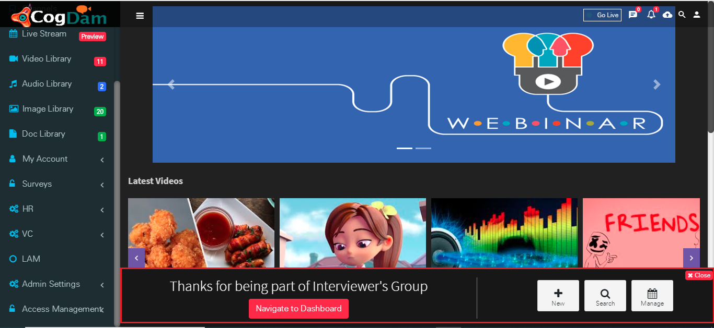

HR interview management page have one special feature of filtering the list according to the meeting start or end date . User can filter the meeting by giving condition of particular mail of interviewee and interview candidate.

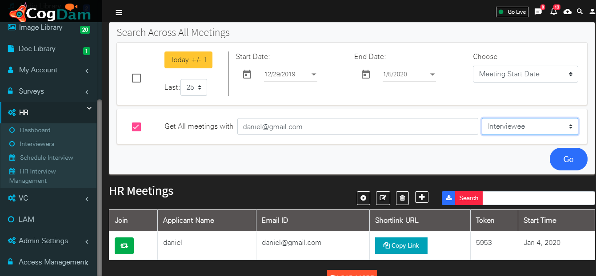

