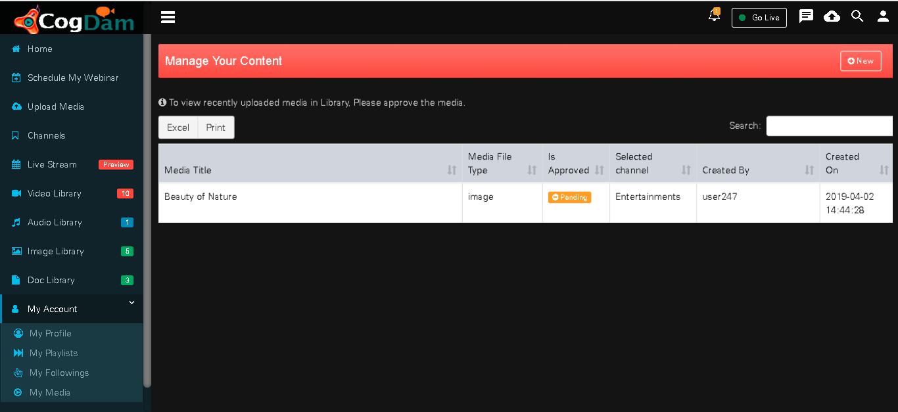

# My Media

We can see our all media here. Select the media to be edited then click on the ‘Edit’ button to edit the media or user can also delete the media

Choose options from the above and edit the media

Make changes need to be made

