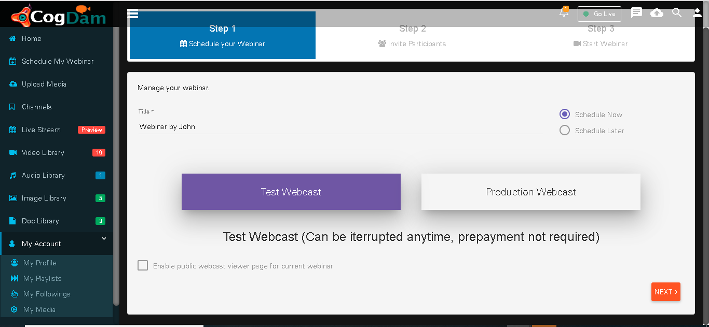
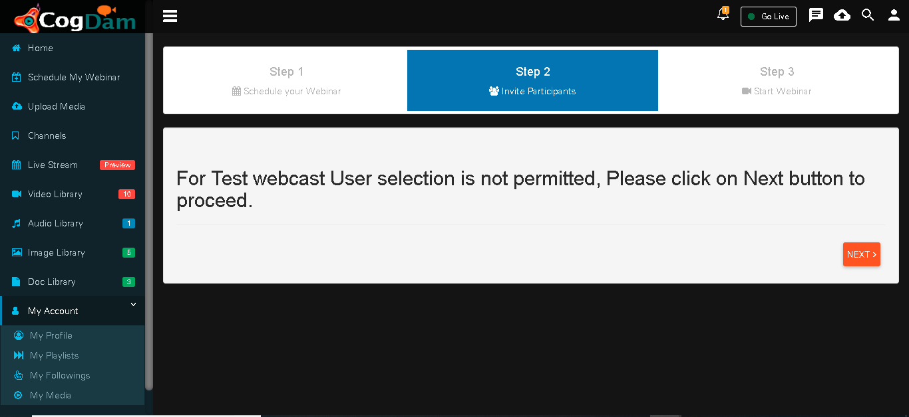
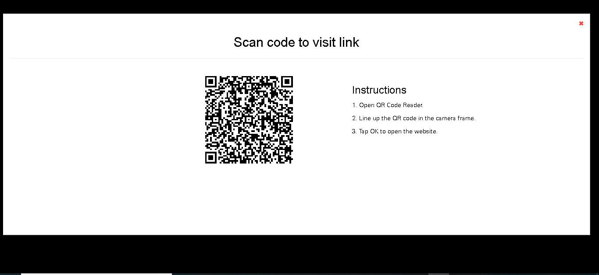

# Schedule My Webinar

This tab provides three steps to start your webinar

Step 1 : Choose type of webinar Test Webinar

Step 2 : Test webinar is free trial and it is by default public

Step 3 : Share your webinar link with users  

For mobile users to see webinar Scan QR code link is provided

For web users the Public link of webinar is shared 

Click on Share link the link gets copied automatically and share copied link with users.

Click on JOIN NOW button to Start Webinar

After Join webinar click on Share button or copy link from setting to share link to public user

After Share link Display below page to public user

User can FullScreen there page after click on top right fullscreen button

  
Click on Top Right button displying different button like Reload to refresh page,Low Bandwidth ,Normal Bandwidth,High Bandwidth.

Click on  3 dots and click on Picture in picture by selecting this you can see webinar by doing your other works like you can nevigate to other browser also.

Picture in Picture Mode Displying like below to exit this mode user can click on Exit Picture in Picture mode

Webcaster can share there screen to all users who are watching live webcast. Webcaster can start screenshare in one click from top Screenshare button or by clicking on bottom ScreenShare button you need to click on Start Sharing Screen. only prerequisite is Screenshare extension should be installed.

