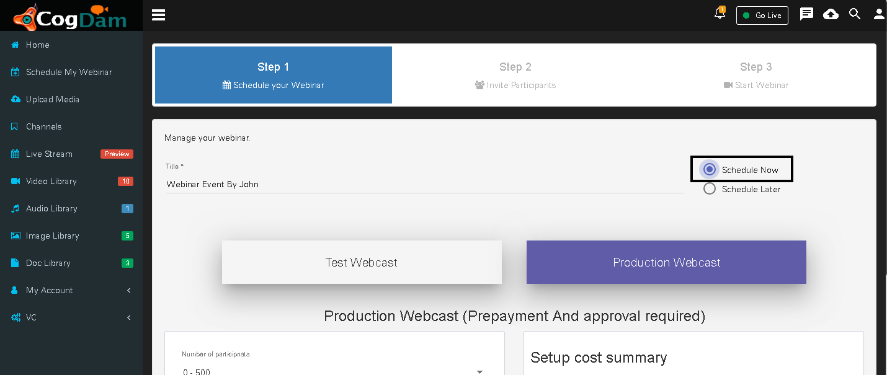

# Production webinar

 In production webinar we can schedule webinar now or later

In Schedule Now there is no need to select Event Start Time and Event End Time

In Schedule Later user need to select Event Start Time and Event End Time

The owner of webinar can select number of users to be added in webinar and according to that the cost will get updated

Owner can select additional options while adding users and that cost will be updated

Have to add Approver's id for approval of webinar. 

Click on Add Approver Button, enter approver email id & press enter button click on update & close button. Entered email ids are display in dropdown list of Approver Email id.

Owner can enable public webcast viewer page by checking in the box and also add password and chat option on clicking on plus icon \(Choose Features\) and click on next button.

Owner can add users from application one by one or in bulk format .Add user in webinar one by one through Single User Upload. Chooes Role like Moderator,Presenter,VC participant ,Viwer,Guest from drop down list to add users 

Click on Choose Existing users Button and select user from list 

Added user in webinar display at right side of page with assign roles

 Moderator Email id will be display in User id list. Select user whome should be kept in CC of webinar mail and click on next button

Owner can add users by bulk upload. select bulk upload and download sample file.

Open sample file and add email id,display\_name,application\_id and Mob number of role which you want to add in meeting. Save file and Upload this .xls file 

 The links of webinar can be shared to the users by three type

* Scan QR Code link is for mobile user. Scanner is required to scan QR code,after scan code directly open webinar link add email id and password and click on Sign In button.

* Webinar Link to share - Copy this link and share to user it will ask for Sign In enter Email id and Password and sign in.

* External app link to share - Copy this link and share to user it will ask for Password ,Enter password and login display live webinar

Click on Start button without Confirm link from approval Displaying notification "Webinar confirmation is pending"

The mail of confirmation of approval will be sent to the Approval mail id then only he will be able to start webinar from respective link given in mail . Click on Click here to Approve link from mail.

Enter Approval Email id and Password and click on Sign in button

Confirmation Pop up come click on Yes to Approve Webinar

Click on Start Webinar button to start webinar

Public webcast viwer page link view

Public webcast viwer page link screenshare view

User can ask question via Q&A Session 

Questions ask by external users display in Admin user chat panel

Viewer link view of webinar

Viewer link screenshare view of webinar

To Disconnect Webinar click on Disconnect button and click on yes on confirmation window.

Setting tab display Meeting Details and User Details also user can Edit meeting using Setting

* Meeting details display Meeting name ,Created by , Meeting Start time and end time

* User Details Display Added user roles and email ids 

