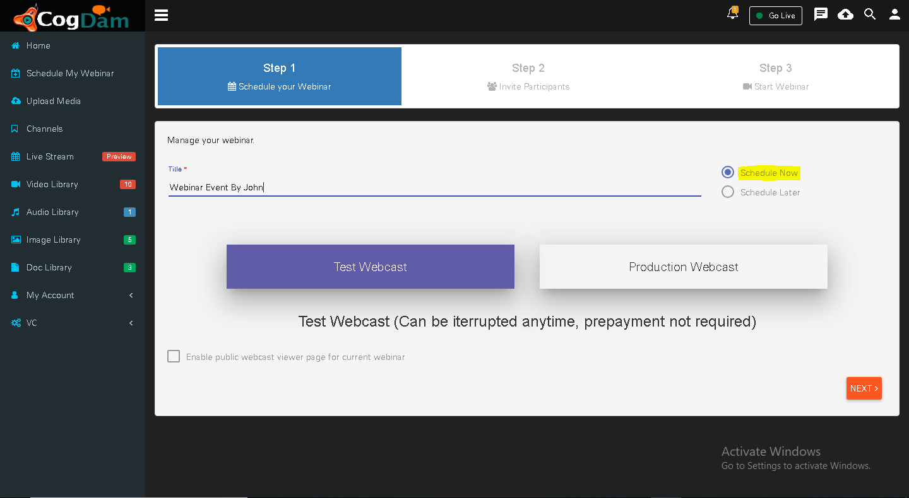
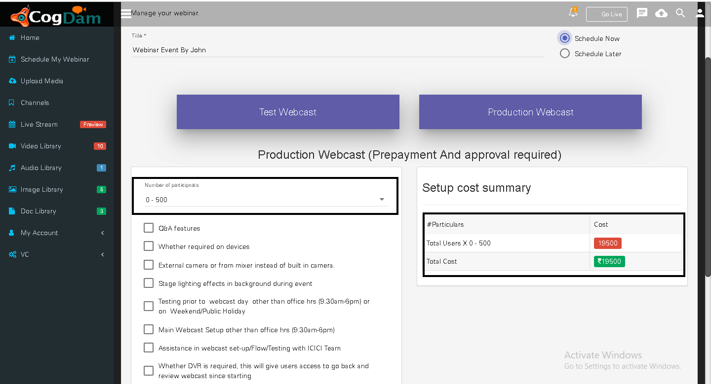
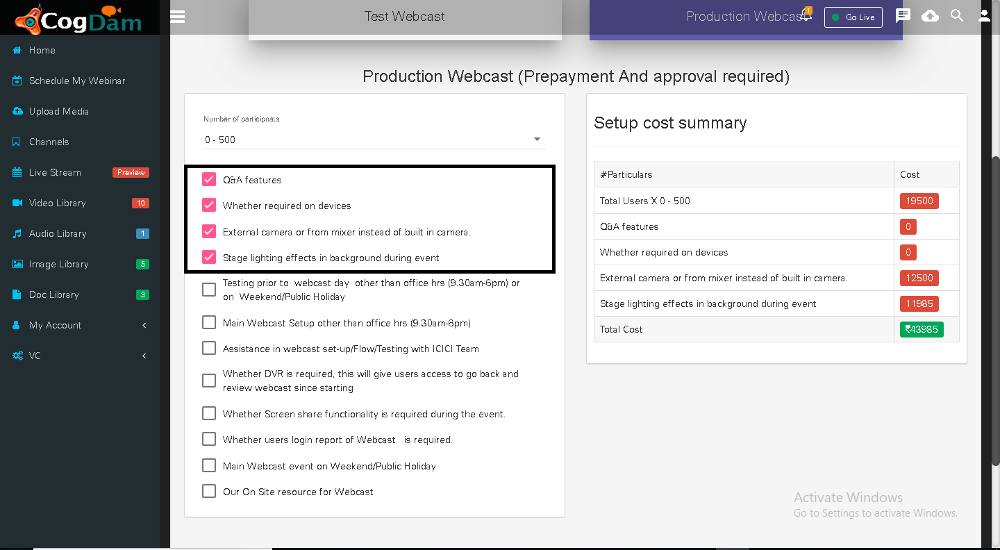
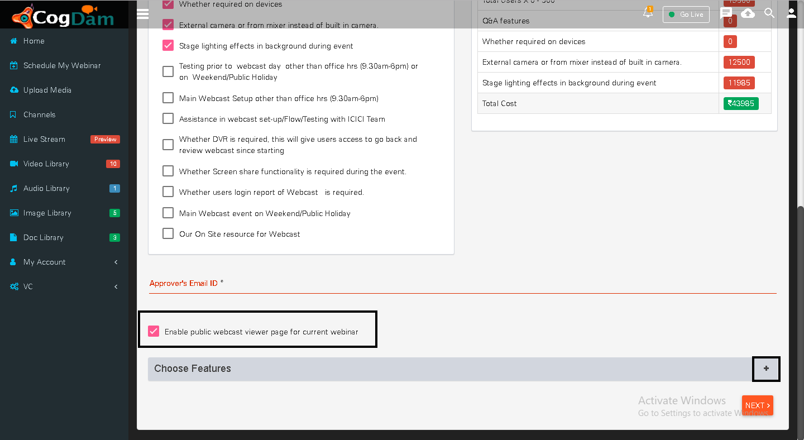
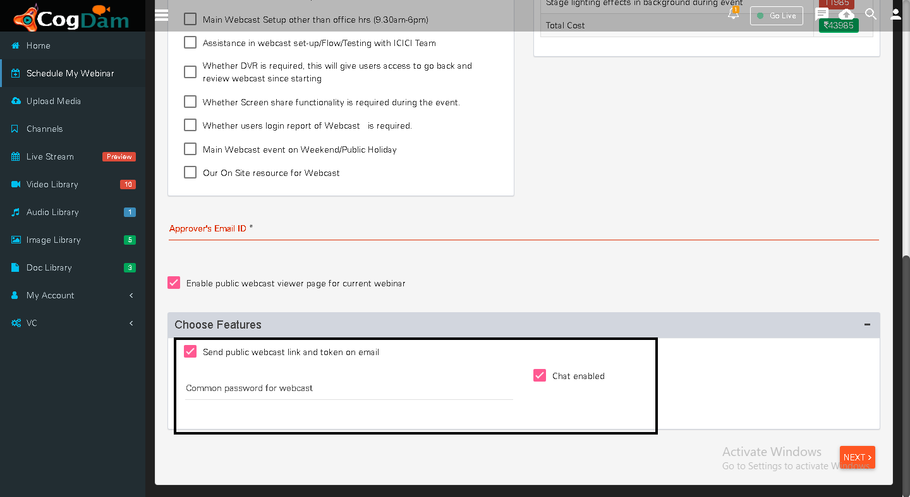
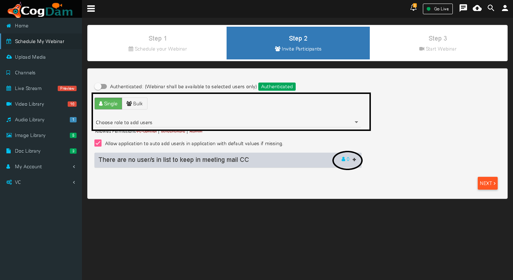
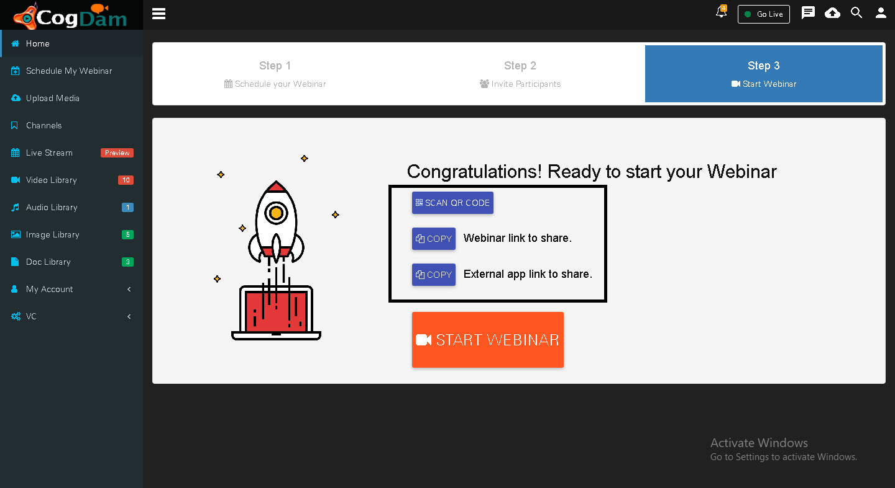
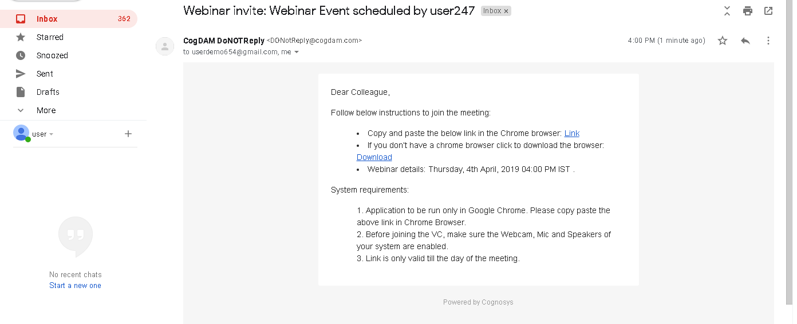
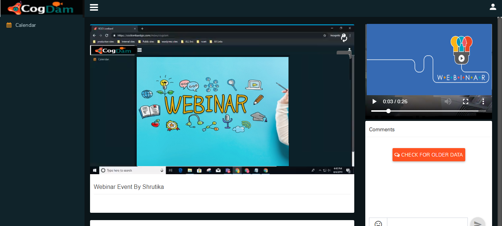

# Production webinar

 Step 1 : In production webinar we can schedule webinar now or later

Step 2 : The owner of webinar can select number of users to be added in webinar and according to that the cost will get updated

Step 3 : Owner can select additional options while adding users and that cost will be updated

Step 4 : Have to add Approver's id for approval of webinar

Step 5 : Owner can enable public webcast viewer page by checking in the box and also add password and chat option on clicking on plus icon

Step 6 : Owner can add users from application one by one or in bulk format and can also add users whom should be kept in CC of webinar mail

Step 7 : The links of webinar can be shared to the users by three type

Step 8 : The mail of confirmation of approval will be sent to the owner's mail id then only he will be able to start webinar from respective link given in mail

Public link view

Public link screenshare view

Viewer link view

Viewer link screenshare

