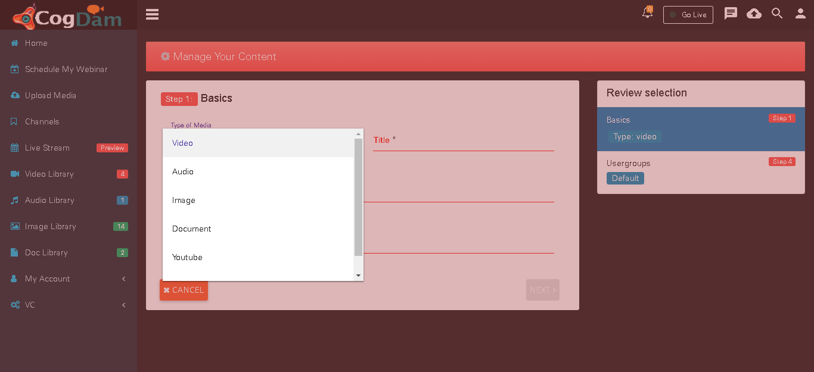
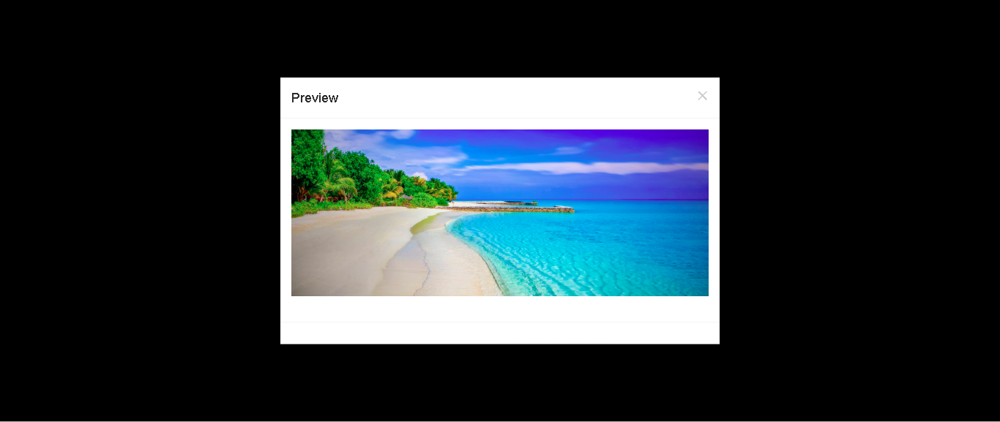
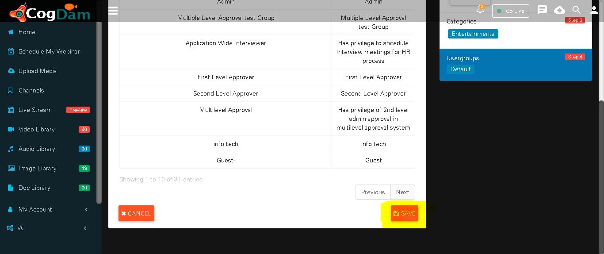

# Upload Media

Steps to upload any media in application

Select type of media : Select type of media from drop down list as Audio, Video, Document or Youtube.

Fill all the information about media and click on next

Select file for uploading

Click on Preview button to view your image

Check Preview

Assign channel in which media is to be upload

Assign Visibility group of media

Click on save to save media file

