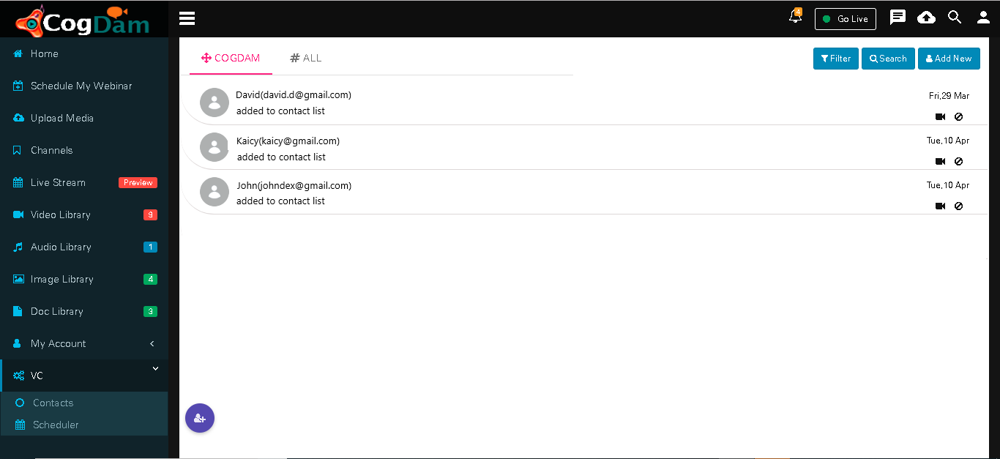

# Contact

We can see all contacts present in application on ‘\#ALL’ tab

we can added contacts from ‘\#ALL’ tab in ‘COGDAM’ tab by click on ‘Add to contact’ icon

Click on ‘Filter’ button to filter users by Contacts, Groups, All

With selected contact we can do one-to-one chat

We can do one-to-one call with selected contact. We can share our screen by clicking on ‘ScreenShare’ option .

Click on ‘Add User/Group’ icon and we can add a contact.

You can search desired contact or group by entering name and then click on ‘Go’ button

##  **Create Group**

Click on ‘Add Contatct/Group’ icon then contact type as ‘Group’ then fill in relevant details.

Click on Add Users button and select the user type

By clicking on name of user you can add that user.

Group Created

By clicking on group you can see group details.

We can add new users in a group just by clicking on’+’ icon of selected user.

We can do group call also by click on ‘Video call’ icon in group window.

