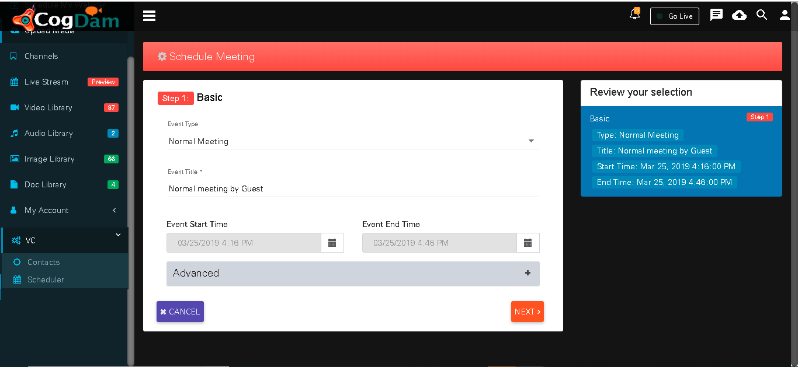
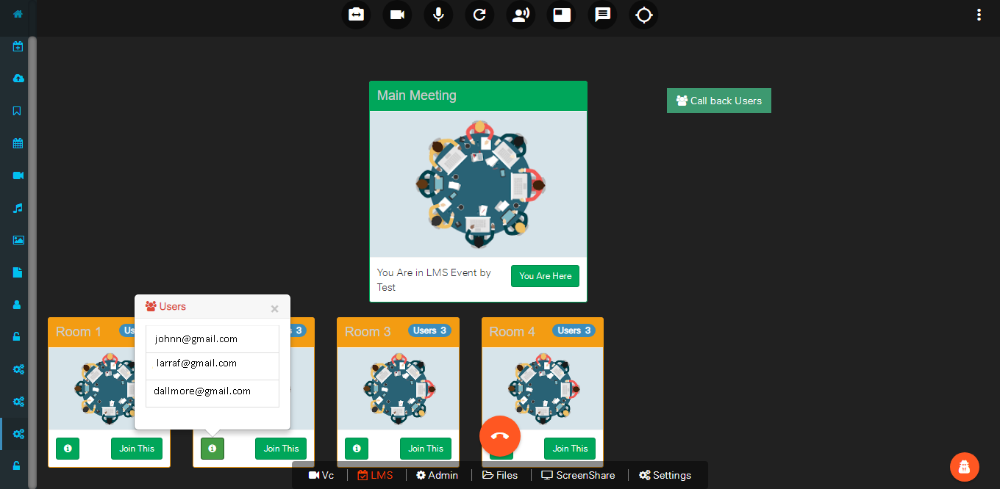
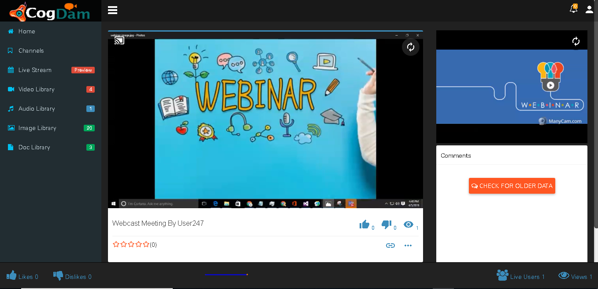

# Scheduler

This window shows Upcoming event list wise and calendar wise.

###  **Normal Meeting**

Click on Create Meeting icon and in ‘Basic Info’ tab select Event Type as ‘Normal meeting’ and fill in relevant info.

After Selected Role and Selected Users get Added then they will be display as below.

When we select User Role as a’ Guest’ then fill in relevant information and click on ‘Add Guest’ button.

After creation of Meeting will be display in notification bar and on calendar.

Click on that meeting notification on calendar will show you ‘Meeting Details’ and ‘User Details’ tab. where you can see meeting as well as user details. Now click on ‘Join’ button to join meeting

You have to click on Call icon to start meeting

Now turn your ‘VC’ ON

If you want connect with Viewer then you need to turn ON ‘VC’ of Viewer. To turn it ON go to ‘Settings’ and click on ‘VC Control’.

After turning ‘VC’ ON

If you want to ask questions in meeting then click on ‘Raise hand’ icon.

Click on share your screen option icon you can share your screen.

After sending message if you click on ‘Pull to Loby’ or ‘pull to VC’ the message going to send to that particular person only but if you click on ‘Chat’ icon then message will be display in group.

For editing of meeting info go to ‘Settings’ tab where we can edit meeting info but meeting type is not editable.

### LMS Meeting

 **Upload Document**

After uploading a document

Go to calendar event and click on desired event notification to join Event.

When you click on ‘LMS’ it shows the event info, number of users…etc

User can allocated rooms deciding how many users in one room

We can share our files during the meeting so everyone can interact with it.

When we get connected in meeting we can see self feed and conference feed on our page.

Click on share your screen option icon you can share your screen.

After screen-sharing it gets visible at left corner

You can ask question during meeting by clicking on ‘Raise hand’ icon.

If you want one to one communication between clients you can use ‘Pull to VC’ or ‘Pull to Lob**b**y’ option for chatting.

Click on chat option and you can chat with all\(ie. Message will display to all in meeting\)

###  **Webcast Meeting**

Click on Create Meeting icon and in ‘Basic Info’ tab select Event Type as ‘Webcast meeting’ and fill in relevant info.

After Selected Role and Selected Users get Added then they will be display as below.

When we select User Role as a’ Guest’ then fill in relevant information and click on ‘Add Guest’ button.

After creation of Meeting will be display in notification bar and on calendar.

Click on that meeting notification on calendar will show you ‘Meeting Details’ and ‘User Details’ tab. where you can see meeting as well as user details. Now click on ‘Join’ button to join meeting

User gets join now popup when he joins with webcam


Consider Webinar Image as user feed and screenshare also


When he joins meeting the pop up generates to ask to starte broadcasting 

Click on share icon to share  link

Single user link feed

Single user screenshare feed

Public link view feed

Public link screenshare feed

