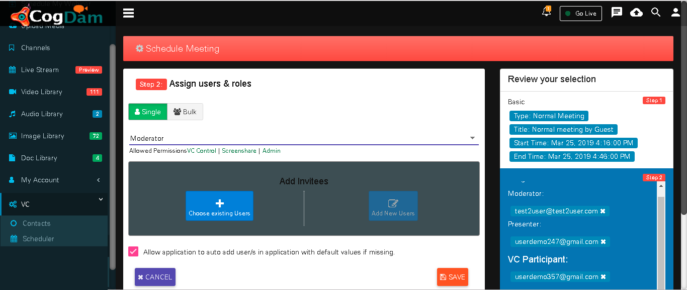
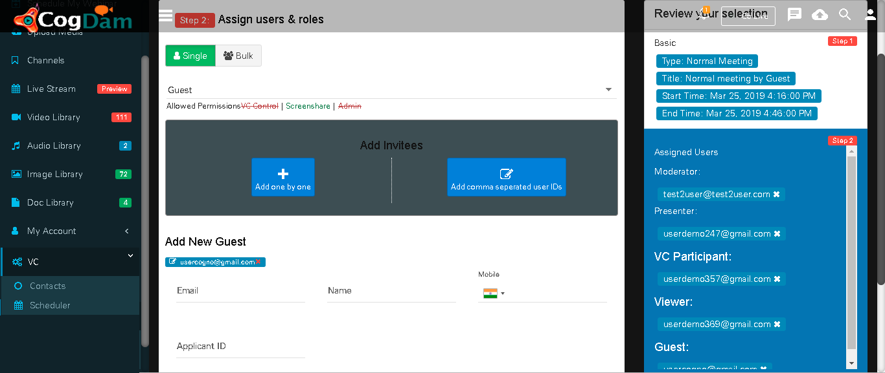
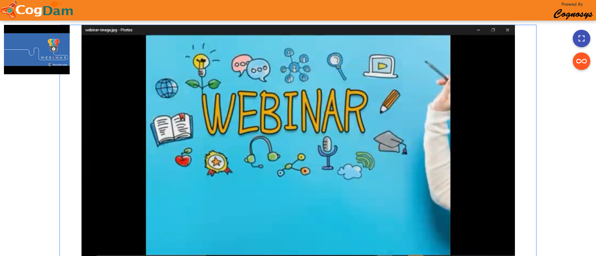

# Webcast Event

Click on Create Meeting icon and in ‘Basic Info’ tab select Event Type as ‘Webcast Event’ and fill in relevant info.

After Selected Role and Selected Users get Added then they will be display as below.

When we select User Role as a’ Guest’ then fill in relevant information and click on ‘Add Guest’ button.

After creation of Meeting will be display in notification bar and on calendar.

Click on that meeting notification on calendar will show you ‘Meeting Details’ and ‘User Details’ tab. where you can see meeting as well as user details. Now click on ‘Join’ button to join meeting

User gets join now popup when he joins with webcam


Consider Webinar Image as user feed and screenshare also


When he joins meeting the pop up generates to ask to starte broadcasting 

Click on share icon to share  link

Single user link feed

Single user screenshare feed

Public link view feed

Public link screenshare feed

