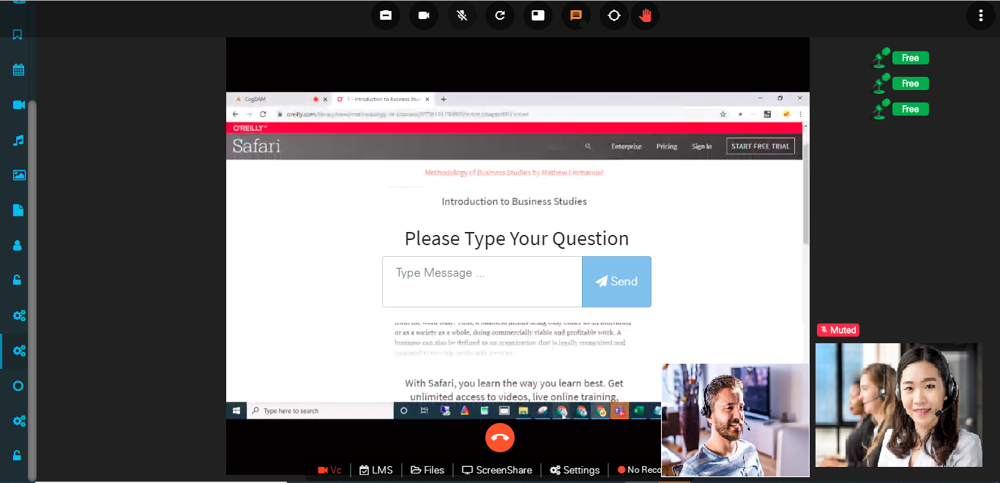

# LMS Event

Click on Create Meeting icon and in ‘Basic Info’ tab select Event Type as ‘LMS Event’ and fill in relevant info.

**Upload Document**

After uploading a document

Go to calendar event and click on desired event notification to join Event.

When more than three users are joined then it will show mic control to the moderator and owner of the meeting, from this mic control option moderator and owner can ON/OFF the mic of the users in meeting.At one time only three users can talk.

When you click on ‘LMS’ It displays the window to allocate the rooms deciding how many users in one room .

After allocating rooms user info can be seen and user can join that room through join button.

We can share our files during the meeting so everyone can interact with it.

When we get connected in meeting we can see self feed and conference feed on our page.

Click on share your screen option icon you can share your screen.

After screen-sharing screen-share displays to all the users and the user who is sharing screen its Camera feed will be shown at the bottom right corner of the screen-share feed.

You can ask question during meeting by clicking on ‘Raise hand’ icon.

If any user wants to come in meeting, user can request using hand raise and owner or moderator can pull the user from ‘Pull to VC’ or ‘Pull to Lob**b**y’ option for chat box.

Click on chat option and you can chat with all and can send Chat attachments also like any doc file , image, video , audio.

 **Moderator or owner can start meeting recording**

Click on 3 hamburger dot from right top and then click on Record session: start button, before start recording displaying No recording at bottom.

After start recording display Recording in green text at bottom. if admin want to stop recording he can stop from top right **Record session: stop** button

User can disconnect meeting from disconnect button.

Meeting recording saved in My recording menu. user can click on recording and see Meeting recording video.

If the User want to Record The Meeting Press the 3 dot and click on the third button and your Recording will start. 

