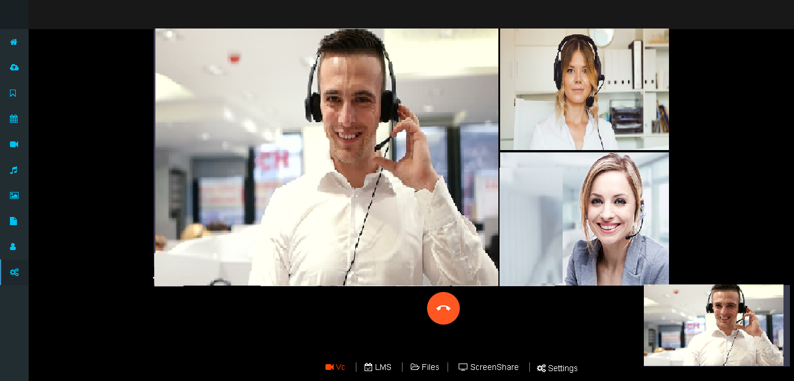
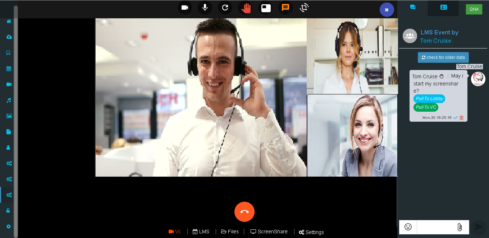
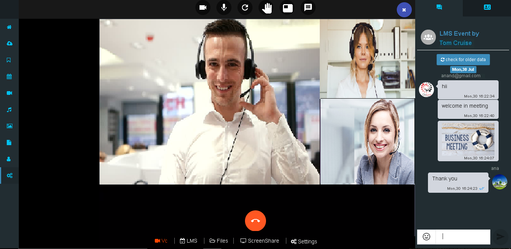

# LMS Event

Click on Create Meeting icon and in ‘Basic Info’ tab select Event Type as ‘LMS Event’ and fill in relevant info.

**Upload Document**

After uploading a document

Go to calendar event and click on desired event notification to join Event.

When you click on ‘LMS’ it shows the event info, number of users…etc

User can allocated rooms deciding how many users in one room

We can share our files during the meeting so everyone can interact with it.

When we get connected in meeting we can see self feed and conference feed on our page.

Click on share your screen option icon you can share your screen.

After screen-sharing it gets visible at left corner

You can ask question during meeting by clicking on ‘Raise hand’ icon.

If you want one to one communication between clients you can use ‘Pull to VC’ or ‘Pull to Lob**b**y’ option for chatting.

Click on chat option and you can chat with all\(ie. Message will display to all in meeting\)

 **Moderator or owner can start meeting recording**

Click on 3 hamburger dot from right top and then click on Record session: start button, before start recording displaying No recording at bottom.

After start recording display Recording in green text at bottom. if admin want to stop recording he can stop from top right **Record session: stop** button

Meeting recording saved in My recording menu. user can click on recording and see Meeting recording video.

### 

