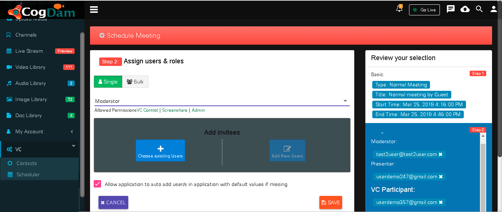
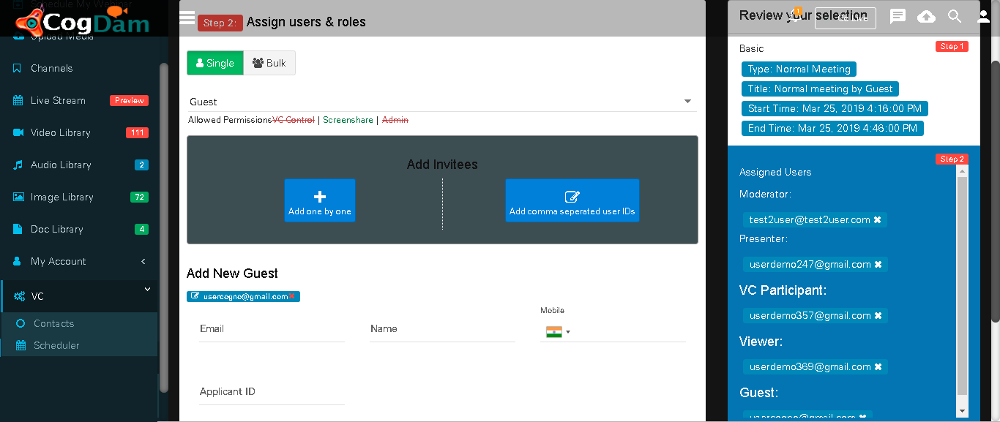

# Normal Meeting

Click on Create Meeting icon and in ‘Basic Info’ tab select Event Type as ‘Normal meeting’ and fill in relevant info.

After Selected Role and Selected Users get Added then they will be display as below.

When we select User Role as a’ Guest’ then fill in relevant information and click on ‘Add Guest’ button.

After creation of Meeting will be display in notification bar and on calendar.

Click on that meeting notification on calendar will show you ‘Meeting Details’ and ‘User Details’ tab. where you can see meeting as well as user details. Now click on ‘Join’ button to join meeting

You have to click on Call icon to start meeting

Now turn your ‘VC’ ON

If you want connect with Viewer then you need to turn ON ‘VC’ of Viewer. To turn it ON go to ‘Admin’ and click on ‘VC Control’.

After turning ‘VC’ ON

If you want to ask questions in meeting then click on ‘Raise hand’ icon.

Click on share your screen option icon you can share your screen.

After sending message if you click on ‘Pull to Loby’ or ‘pull to VC’ the message going to send to that particular person only but if you click on ‘Chat’ icon then message will be display in group.

For editing of meeting info go to ‘Settings’ tab where we can edit meeting info but meeting type is not editable.

